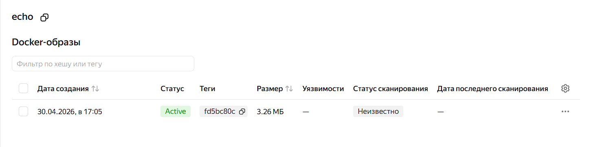

# Публикация docker-образов

Простой пример создания и публикации docker-образов с помощью CI/CD Gitlab.

## Инициализация проекта

Создать переменные окружения:

1. Внутри проекта перейти: `Settings → CI/CD → Variables`
2. `YC_CI_REGISTRY`: ID сервиса для хранения и распространения Docker-образов (см. yandex_container_registry в main.tf); значение должно иметь вид `cr.yandex/<registry_id>`
3. `YC_CI_REGISTRY_KEY`: содержимое созданного файла `.key.json` (см. local_file.key в main.tf) с флагом **MASKED**. Для этого:
  - убедиться, что `.key.json` заканчивается на `}`, не на пустую строку
  - выполнить команду: `echo -n "json_key:$(cat .key.json)" | base64 -w 0`
  - полученный хеш указать как значение создаваемой переменной

## Документация

- [Yandex Container Registry](https://yandex.cloud/ru/docs/container-registry/)
